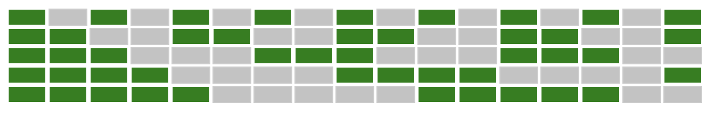

## Algo 5-2020

# green cells puzzle

Checks repeating instances in a table pattern

## Description

Given this table:



Find how many columns will be all green cells for the first 1000 columns? 

## Solution

The first row displays a green cell every other cell. The 2nd row displays 2 green cells every 2 cells. The 3rd row displays 3 green cells every 3 cells, etc. 

Create a 2D array which recreates it, check for the columns where all cells are green. 

```
// create empty 2D array
let arr = new Array(1001)

for (let i = 0; i < arr.length; i++) {
    arr[i] = new Array(5)
}

// populate 2d array with green cells
for (let i = 0; i < arr.length; i++) {
    arr[i][0] = [1].includes(i % 2) ? 1 : 0
    arr[i][1] = [1,2].includes(i % 4) ? 1 : 0
    arr[i][2] = [1,2,3].includes(i % 6) ? 1 : 0
    arr[i][3] = [1,2,3,4].includes(i % 8) ? 1 : 0
    arr[i][4] = [1,2,3,4,5].includes(i % 10) ? 1 : 0
}

// check how many columns are all green cells
let count = 0;

arr.forEach(i => {
    if (i.reduce((a, b) => a + b, 0) == 5) count++
})

console.log(count) // 51
```

Time complexity of O(5n) or O(n).
